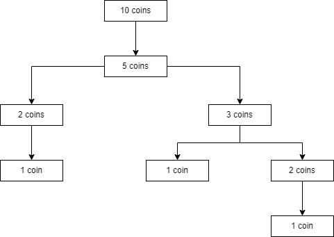

# Fair coins

## Description
You have n fair coins and you flip them all at the same time (Fair means that the coin has a 50-50% chance of getting HEADS or TAILS). Any that come up tails you set aside. The ones that come up heads you flip again. How many rounds do you expect to play before only one coin remains?

Write a function that, given n, returns the number of rounds you'd expect to play until one coin remains.

## Examples
### Example 1
If you have 8 fair coins. Then:
- 1st flip: 4 coins remain.
- 2nd flip: 2 coins remain.
- 3rd flip: 1 coin remains.
So, the function must return in this case 3

### Exemple 2
Let's assume another example where we'll have multiple scenarios (Encountering an odd number), in this schema we can count 3 scenarios:
- Scenario 1: 10 coins -> 5 coins -> 2 coins -> 1 coins. We play 3 flips before only one coin remains.
- Scenario 2: 10 coins -> 5 coins -> 3 coins -> 1 coins. We play 3 flips before only one coin remains.
- Scenario 3: 10 coins -> 5 coins -> 3 coins -> 2 coins -> 1 coins. We play 4 flips before only one coin remains.  

[Return to the main readme file](../../../../../../..)